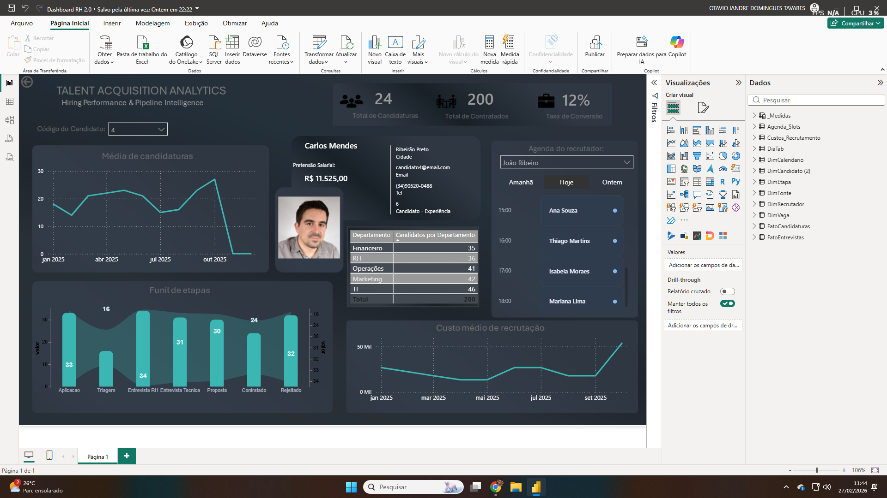

Talent Acquisition Analytics
📌 Overview

Este projeto consiste no desenvolvimento de um dashboard analítico para monitoramento e otimização do processo de recrutamento e seleção (Talent Acquisition).

O objetivo principal é consolidar dados operacionais de RH em uma estrutura analítica escalável, permitindo análise de desempenho do funil de contratação, eficiência do processo seletivo e controle de custos.

O projeto foi desenvolvido com foco em:

- Modelagem dimensional adequada

- Boas práticas em DAX

- Performance analítica

- Clareza na comunicação visual

- Organização estruturada para portfólio

🎯 Problema de Negócio

Processos de recrutamento frequentemente apresentam:

- Dados distribuídos em múltiplas fontes

- Falta de indicadores consolidados

- Dificuldade em medir eficiência do funil

- Ausência de controle analítico sobre custos

- Baixa visibilidade da performance por recrutador

Este dashboard resolve esses problemas ao estruturar os dados em modelo estrela e disponibilizar indicadores estratégicos em tempo real.

🛠️ Stack Tecnológica

- Power BI Desktop

- DAX (Data Analysis Expressions)

- Power Query (ETL e transformação de dados)

- Modelagem Dimensional (Star Schema)

- Visual customizado com Deneb (Vega-Lite)

🧠 Arquitetura de Dados

O modelo foi estruturado em formato estrela, separando claramente tabelas fato e dimensões.

🔹 Tabelas Fato

- FatoCandidaturas

- FatoEntrevistas

- Custos_Recrutamento

Essas tabelas concentram eventos transacionais e métricas quantitativas.

🔹 Tabelas Dimensão

- DimCandidato

- DimRecrutador

- DimEtapa

- DimCalendario

- DimVaga

As dimensões garantem contexto analítico e permitem segmentação eficiente.

🔎 Componentes Analíticos

O dashboard contempla:

- KPI Cards estratégicos

- Taxa de conversão de contratação

- Evolução temporal de candidaturas

- Funil de etapas do processo seletivo

- Análise de custo médio de recrutamento

- Agenda operacional por recrutador

- Painel detalhado de perfil do candidato

Todos os indicadores respeitam contexto de filtro e relacionamentos do modelo.

⚙️ Transformações e Tratamento de Dados

Durante o desenvolvimento foram aplicadas:

- Limpeza e padronização de colunas via Power Query

- Normalização de campos textuais

- Separação de dimensões

- Tratamento de divisão por zero em medidas

- Ajuste de formatação para indicadores percentuais

- Criação de colunas derivadas para otimização do modelo

🎨 Design e UX

O layout foi desenvolvido com foco em:

- Tema escuro corporativo

- Hierarquia visual baseada em importância analítica

- Uso consistente de cores para KPIs

- Minimização de ruído visual

- Experiência executiva de leitura rápida

🚀 Possíveis Evoluções

- Implementação de análise de tempo médio de contratação

- Indicadores com cor dinâmica baseada em meta

- Navegação via bookmarks

- Versão mobile otimizada

- Integração com base de dados real (SQL Server / Azure)

 ## 📷 Preview

👨‍💻 Autor

Otavio Iandre Domingues Tavares
Estudante de Ciência da Computação
Interesse em Business Intelligence, Data Analytics
